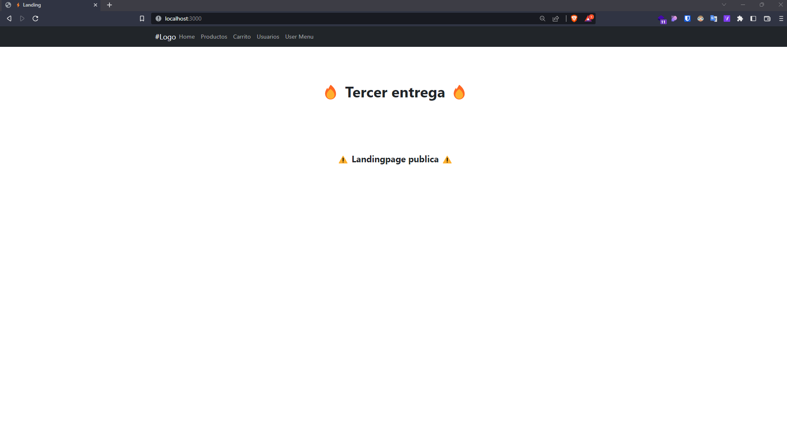
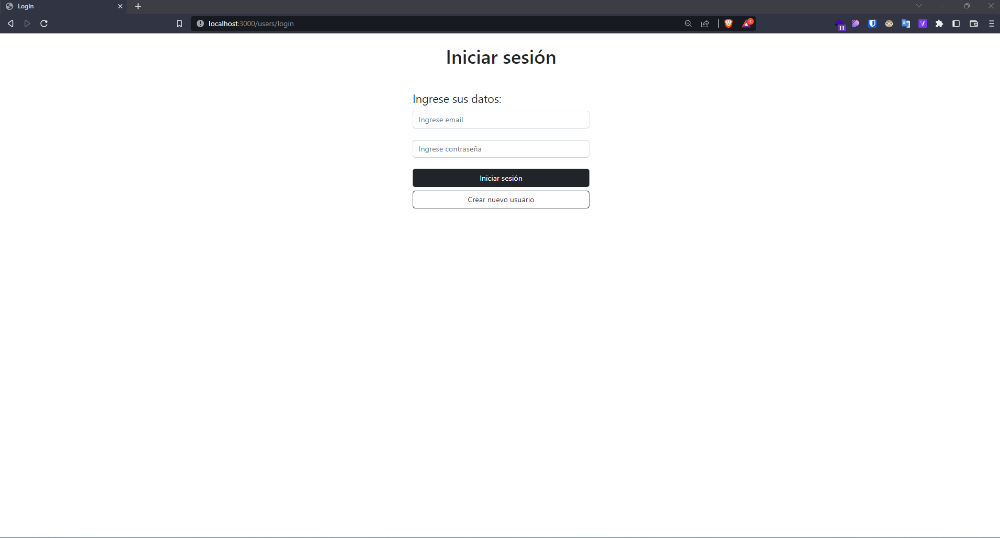
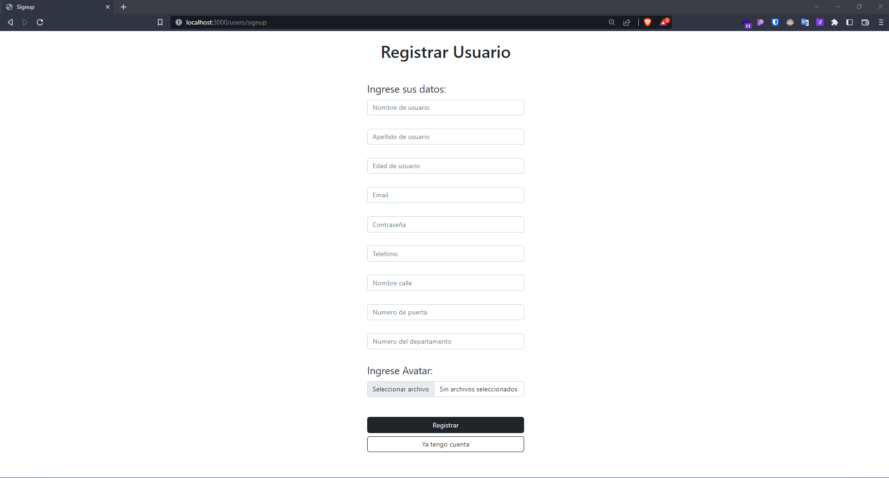
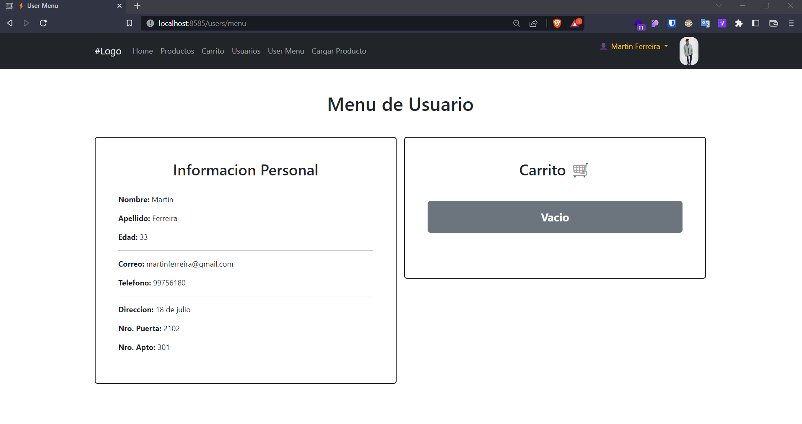
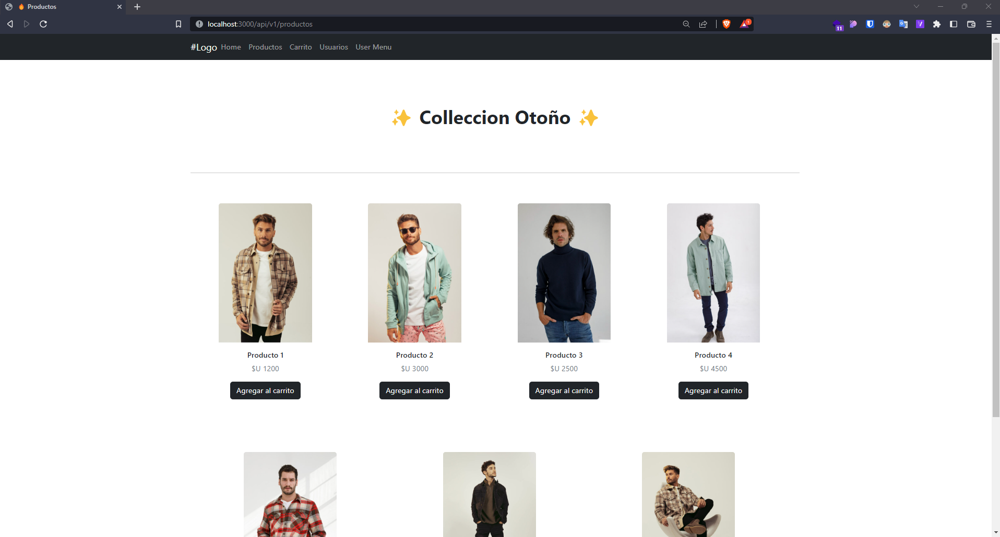
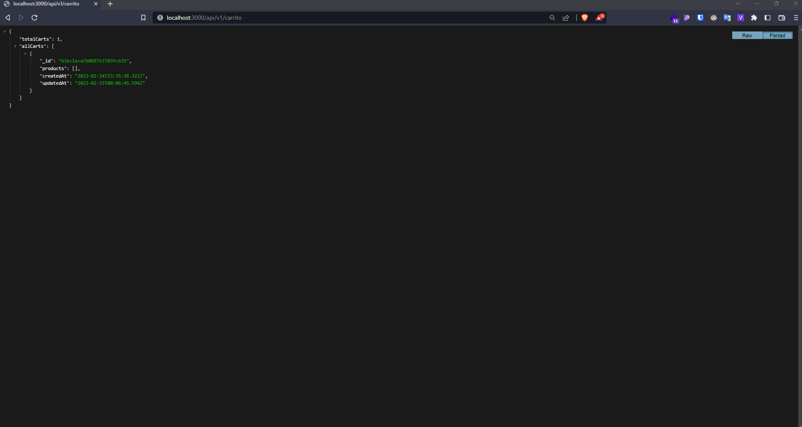
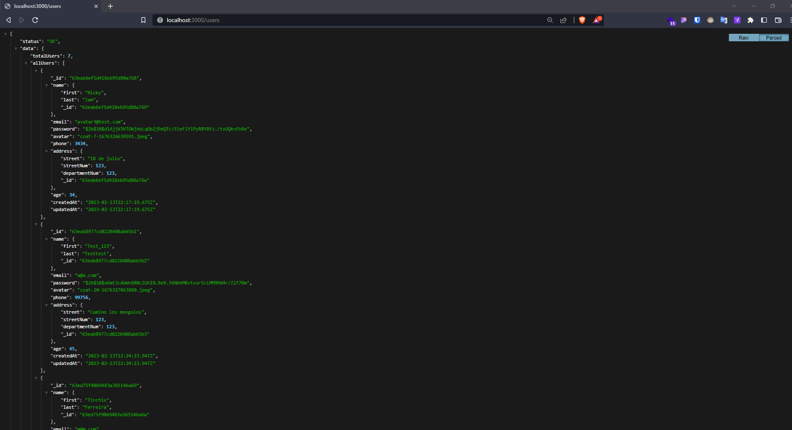

# TERCERA ENTREGA DEL PROYECTO FINAL

Un menú de registro y autenticación de usuarios basado en passport local, guardando en la base de datos las credenciales y el resto de los datos ingresados al momento del registro.

## Se debe entregar:

- El registro de usuario consiste en crear una cuenta en el servidor almacenada en la base de datos, que contenga el email y password de usuario, además de su nombre, dirección, edad, número de teléfono (debe contener todos los prefijos internacionales) y foto ó avatar. La contraseña se almacenará encriptada en la base de datos. ✅

- Ante la incorporación de un usuario, el servidor enviará un email al administrador con todos los datos de registro y asunto 'nuevo registro', a una dirección que se encuentre por el momento almacenada en una constante global. ✅

- El usuario iniciará la acción de pedido en la vista del carrito. ✅

- Será enviado una vez finalizada la elección para la realizar la compra de productos.

- El email contendrá en su cuerpo la lista completa de productos a comprar y en el asunto la frase 'nuevo pedido de ' y el nombre y email del usuario que los solicitó. En el mensaje de whatsapp se debe enviar la misma información del asunto del email.

- El usuario recibirá un mensaje de texto al número que haya registrado, indicando que su pedido ha sido recibido y se encuentra en proceso.

---

## ENDPOINTS

- GET `/` URL publica donde el usuario tendra acceso a determinada informacion

- GET `/users/login` UI de registro de Usuario, se debera registrar con el `email` y `password`

- GET `/users/signup` URL de Registro alta del usuario

- GET `/users/menu` Menu de usuario, una vez registrado y logueado, tendra la opcion de `logout` asi como de ver su avatar.

- GET `/api/v1/productos` Vista de todos los productos

- GET `/api/v1/carrito` ⚠️ _en progreso_

- GET `/users` ⚠️ _en progreso_

