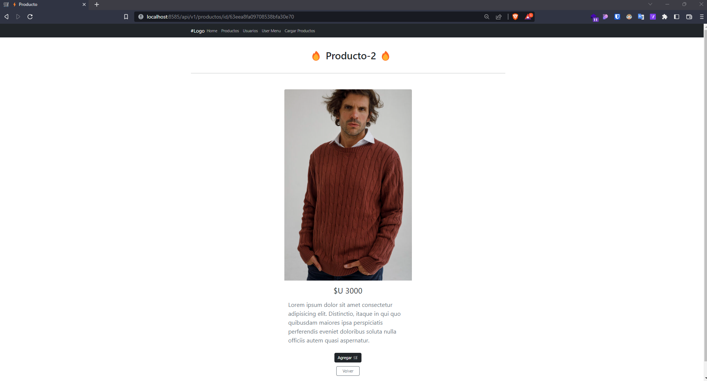
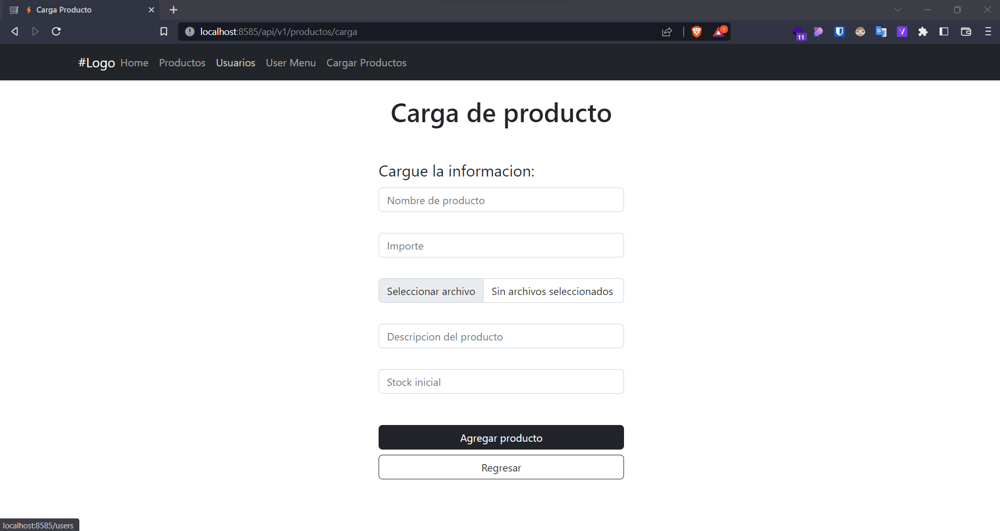

# TERCERA ENTREGA DEL PROYECTO FINAL

Un menú de registro y autenticación de usuarios basado en passport local, guardando en la base de datos las credenciales y el resto de los datos ingresados al momento del registro.

## Se debe entregar:

- El registro de usuario consiste en crear una cuenta en el servidor almacenada en la base de datos, que contenga el email y password de usuario, además de su nombre, dirección, edad, número de teléfono (debe contener todos los prefijos internacionales) y foto ó avatar. La contraseña se almacenará encriptada en la base de datos. ✅

- La imagen se podrá subir al servidor y se guardará en una carpeta pública del mismo a la cual se tenga acceso por url. ✅

- El usuario se logueará al sistema con email y password y tendrá acceso a un menú en su vista, a modo de barra de navegación. Esto le permitirá ver los productos totales con los filtros que se hayan implementado y su propio carrito de compras e información propia (datos de registro con la foto). Además, dispondrá de una opción para desloguearse del sistema. ✅

- Ante la incorporación de un usuario, el servidor enviará un email al administrador con todos los datos de registro y asunto 'nuevo registro', a una dirección que se encuentre por el momento almacenada en una constante global. ✅

- El usuario iniciará la acción de pedido en la vista del carrito. ✅

- Será enviado una vez finalizada la elección para la realizar la compra de productos. ✅

- El email contendrá en su cuerpo la lista completa de productos a comprar y en el asunto la frase 'nuevo pedido de ' y el nombre y email del usuario que los solicitó. En el mensaje de whatsapp se debe enviar la misma información del asunto del email. ✅

- El usuario recibirá un mensaje de texto al número que haya registrado, indicando que su pedido ha sido recibido y se encuentra en proceso. ✅

---

## Descargar repositorio

Debes clonar el repositorio con el siguiente codigo:

```
git clone https://github.com/martinfyic/tercera-entrega-backend.git
```

una vez clonado debes dirigirte a la carpeta del repositorio:

```
cd tercera-entrega-backend
```

cuando estes en la carpeta debes correr el siguiente comando para que se instalen las dependencias necesarias para correr este desafio:

```
npm i

ó

npm install
```

### dependencias utilizadas en este desafio son:

- bcrypt: 5.1.0,
- cors: 2.8.5,
- dotenv: 16.0.3,
- ejs: 3.1.8,
- express: 4.18.2,
- express-session: 1.17.3,
- express-validator: 6.14.3,
- mongoose: 6.9.1,
- multer: 1.4.5-lts.1,
- nodemailer: 6.9.1,
- passport: 0.6.0,
- passport-local: 1.0.0,
- twilio: 4.7.2,
- winston: 3.8.2,

Recomendación instalar `nodemon` como dependencia de desarrollo `npm i -D nodemon`

---

## Breve descripción del desafío:

Simula un ecommerce, donde el usuario deberá registrarse o loguearse en la app para poder acceder a comprar o ver su menú de usuario en la app. En el caso que sea un nuevo usuario se debera registrar, una vez finalizada la registración se enviara mail al admin informando de un nuevo registro con la información del nuevo usuario.

Cuando el usuario agrega productos al carrito se irá mostrando en el menu de usuario para que pueda finalizar la compra luego de llenado del mismo.

Una vez finalizada la compra en el carrito se generará una orden, donde:

1. Se enviara mail al administrador informando la nueva compra con el detalle de la misma.
2. Se enviara mensaje via whatsapp al usuario indicandole nro de orden e informandole que se recibio la orden

---

## Endpoints

- GET `/` ➡️ URL publica donde el usuario tendra acceso a determinada informacion


- GET `/users/login` ➡️ UI de registro de Usuario, se debera registrar con el `email` y `password`


- GET `/users/signup` ➡️ URL de Registro alta del usuario


- GET `/users/menu` ➡️ Menu de usuario, una vez registrado y logueado, tendra la opcion de `logout` asi como de ver su avatar.


- GET `/api/v1/productos` ➡️ Vista de todos los productos


- GET `/api/v1/productos/id/:prodId` ➡️ Vista producto seleccionado



- GET `/api/v1/productos/carga`



- GET `/api/v1/carrito` ➡️ ⚠️ _en progreso_


- GET `/users` ➡️ ⚠️ _en progreso_


- POST `/api/v1/carrito` ➡️ Crear carrito
- POST `/api/v1/carrito/:cartId/productos` ➡️ Agregar producto al carrito
- POST `/api/v1/ordenes` ➡️ Crea una nueva orden de compra
- POST `/api/v1/productos` ➡️ Crea nuevo producto

### Video ilustrativo

Breve demostración de funcionamiento de la app ( ⚠️ aun en construcción )


---

## Variables de entorno

Para correr el proyecto necesitas las siguientes variables de entorno:

`PORT`

`MONGODB_URL`

`PASSPORT_SECRET`

`NODEMAILER_EMAIL`

`NODEMAILER_EMAIL_ADMIN`

`NODEMAILER_PASS`

`TWILIO_ACOUNT_SID`

`TWILIO_AUTH_TOKEN`

`TWILIO_PHONE`

`PHONE_TEST` --> opcional ya que corresponde al `user.phone` donde se enviara el mensaje de la compra finalizada.
